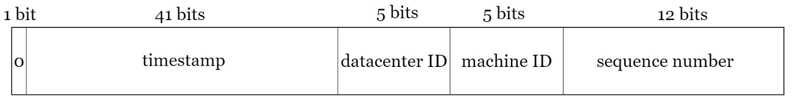

# TinyURL: Big Links, Made Tiny

## Overview
TinyURL is designed to convert long, complex URLs into short, manageable links via the `/encode` and `/decode` endpoints. These shortened links are easier to share, remember, and use, especially on platforms with character limits, like social media.

## Table of Contents
- [Installation](#installation)
- [Features](#features)
- [Security Concerns](#security-concerns)
- [Scalability](#scalability)
- [License](#license)
- [Contact](#contact)

## Installation
For detailed installation instructions, please check the [docs/INSTALLATION.md](docs/INSTALLATION.md) file.

## Features
- Two main endpoints:
  - **`/encode`**: Converts a long URL into a shortened URL.
  - **`/decode`**: Expands a shortened URL back to its original form.
- When users access a shortened URL, they are automatically redirected to the original link.

## Security Concerns

### Malicious URLs
- **Threat:** Users might shorten malicious URLs that lead to phishing sites, malware, or scams.
- **Mitigation:**
  - Use a URL reputation service (such as the Google Safe Browsing API) to scan and block malicious links during submission.
  - Allow users to preview the original URL before redirection.
  - Implement a user reporting system for suspicious links.

### API Abuse (DDoS)
- **Threat:** Without proper rate limiting and authentication, attackers could flood the system with requests.
- **Mitigation:**
  - Implement user authentication to identify and block malicious users.
  - Enforce rate limiting based on IP addresses and user accounts.

### Data Integrity and Privacy
- **Threat:** If URLs contain sensitive information (e.g., tokens or PII), exposure through shortened links can lead to data breaches.
- **Mitigation:**
  - Educate users to avoid shortening URLs with sensitive query parameters.
  - Allow users to delete their shortened URLs when no longer needed.

### Brute Force Attacks
- **Threat:** Attackers might attempt to guess short URLs through brute-force enumeration.
- **Mitigation:**
  - Use longer, randomized strings for short URLs (e.g., 8–10 characters), though this may slightly reduce URL compactness.
  - Monitor and block excessive invalid link requests.
  - Expire unused links after a specified period.

### Cross-Site Scripting (XSS)
- **Threat:** Malicious links could exploit users' browsers through cross-site scripting (XSS).
- **Mitigation:**
  - Prevent users from submitting URLs that exhibit signs of XSS.
  - Avoid executing JavaScript within link previews.

### Analytics & Tracking Risks
- **Threat:** Tracking parameters can expose users’ behaviors or personal data.
- **Mitigation:**
  - Anonymize tracking data.
  - Allow users to opt out of link tracking.
  - Ensure compliance with privacy regulations, such as GDPR.

## Scalability

### Unique Identifier Generation
To prevent collisions, the project uses a unique identifier generator inspired by [Twitter's Snowflake ID](https://en.wikipedia.org/wiki/Snowflake_ID). The generation process follows these steps:

1. **Timestamp Generation:**
   - Generate a timestamp based on milliseconds since a custom epoch. In this implementation, the epoch is set to `1_737_680_461_000` (January 24, 2025, 01:01:01:000 UTC).

2. **Machine ID:**
   - Extract the machine ID from the environment variable `ENV['MACHINE_ID']`. This ID ranges from 0 to 1023 (10 bits), allowing up to 1,024 instances.

3. **Sequence Number:**
   - Determine the sequence number by counting how many identifiers are created within a millisecond.
   - Reset the sequence number to `0` every millisecond. It ranges from `0` to `4095` (12 bits).
   - If identifier requests exceed `4096` per millisecond, the system will pause and wait until the next millisecond.

4. **Final ID Construction:**
   - Combine the timestamp, machine ID, and sequence number into a single number.
   - Bitwise shifts are applied as follows:
     - **Timestamp:** Shifted 22 bits to accommodate the machine ID and sequence number.
     - **Machine ID:** Shifted 12 bits to accommodate the sequence number.
   - The final structure resembles the following diagram (note that the timestamp bits are not limited):
     

5. **Base62 Encoding:**
   - Encode the final number in Base62 to reduce the identifier length.

6. **Uniqueness Guarantee:**
   - This approach ensures unique identifiers within the same server.
   - To avoid collisions across multiple servers, ensure each instance has a unique `ENV['MACHINE_ID']`.

---

### Handling Increasing Traffic
To handle higher traffic, maintain fast response times, and ensure high availability, the following strategies are applied across different layers:

- **Application Layer:**
  - Cache popular URLs in memory (e.g., Redis) to reduce database lookups.

- **Database Layer:**
  - **Indexing:** Index the identifier and original URL for fast lookups.
  - **Read/Write Separation:** Use the primary database for writes and replicas for reads, as the application will be read-heavy.

- **Infrastructure Layer:**
  - **Load Balancing:** Distribute traffic across multiple application servers using a load balancer.
  - **Auto-Scaling:** Use cloud services (AWS, GCP, Azure) to scale instances based on traffic spikes.
  - **Content Delivery Network (CDN):** Cache popular redirects at edge locations for faster delivery.

---

## License
This project is licensed under the MIT License. See the [LICENSE](https://mit-license.org/) file for details.

## Contact
Maintainer: [Vinh](mailto:vinh2000bt@gmail.com)

---

Happy coding! 🚀
